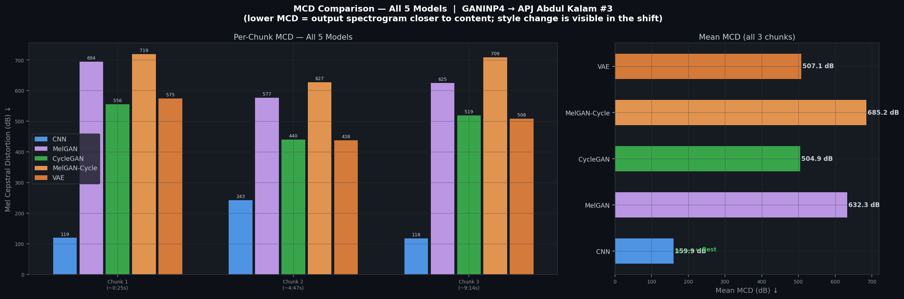
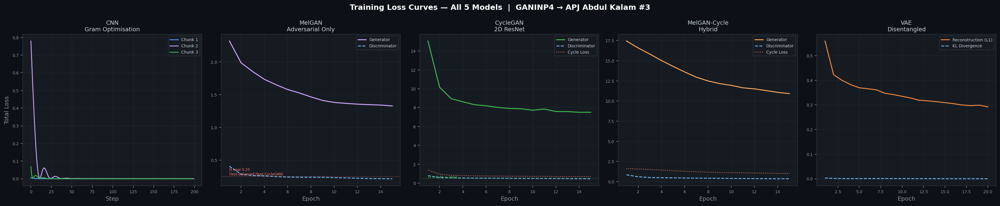
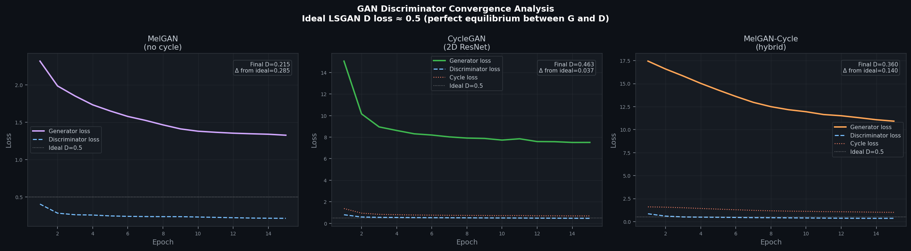
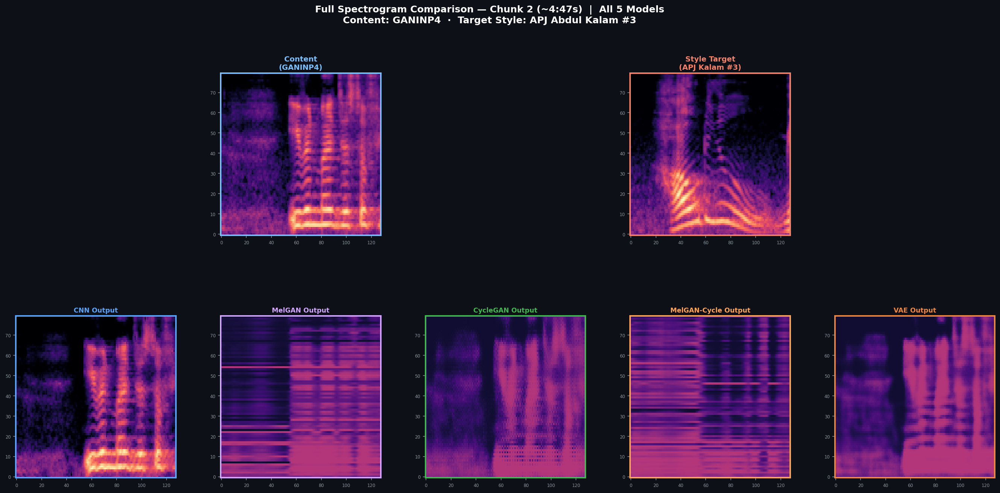
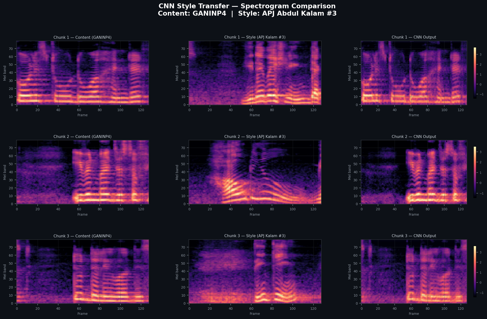
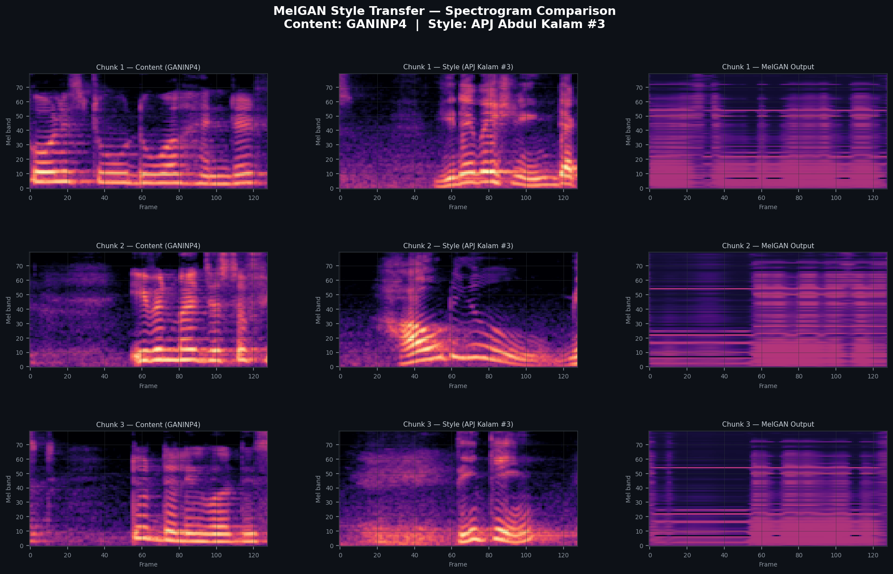
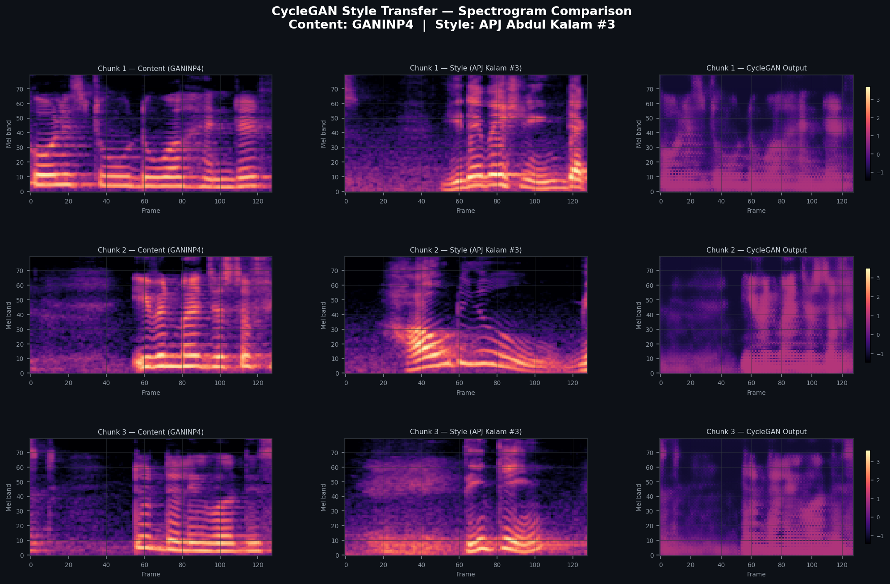
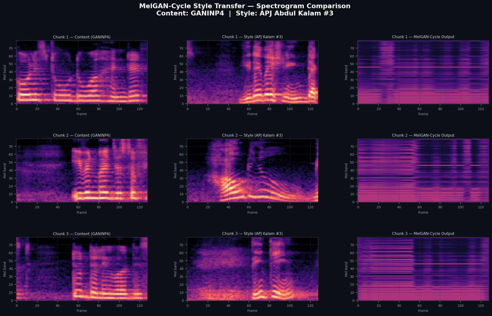
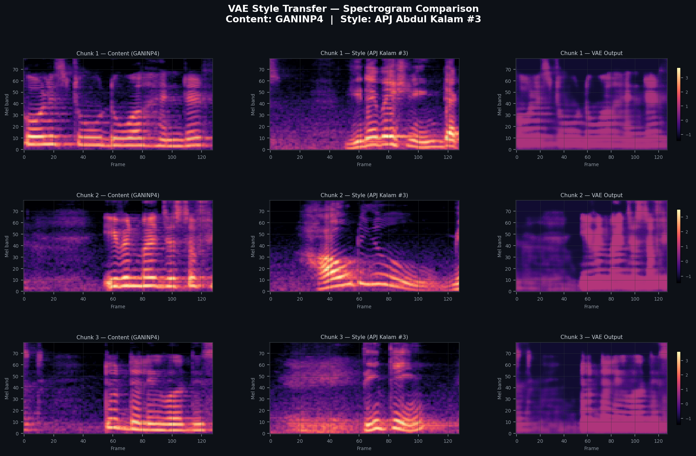

# 🎙️ Exploring Audio Style Transfer Using Deep Neural Networks

<div align="center">


**MTech Thesis · Department of Computer Science and Engineering**

*A systematic five-model comparison of deep neural approaches to cross-speaker vocal style transfer*

**Content Speaker:** Personal voice recording &nbsp;|&nbsp; **Style Target:** Dr. APJ Abdul Kalam

</div>

---

## Abstract

This repository presents an end-to-end research framework for **audio style transfer using deep neural networks**, with the applied goal of transferring the vocal style of Dr. APJ Abdul Kalam onto a personal speech recording. Five architecturally distinct deep learning models are implemented, trained on real audio, and benchmarked against each other:

| # | Model | Paradigm | Key Property |
|---|---|---|---|
| 1 | **CNN** | Optimisation-based | Gram matrix spectral style matching |
| 2 | **MelGAN** | Adversarial (no cycle) | Dilated 1-D residual generator |
| 3 | **CycleGAN** | Adversarial + cycle | Unpaired domain translation |
| 4 | **MelGAN-Cycle** | Hybrid (novel) | MelGAN generator + cycle-consistency objective |
| 5 | **VAE** | Probabilistic | Disentangled content / style latent codes |

> **Research Vision:** If neural style transfer can turn a photograph into a Van Gogh painting, can we transform a spoken sentence so it *sounds like it was spoken by Dr. Kalam*?

---

## Table of Contents

- [Dataset & Acoustic Analysis](#dataset--acoustic-analysis)
- [Model Architectures](#model-architectures)
- [Experimental Results](#experimental-results)
- [Repository Structure](#repository-structure)
- [Installation & Usage](#installation--usage)
- [Adding More Recordings](#adding-more-recordings)
- [Key Findings](#key-findings)
- [Limitations & Future Work](#limitations--future-work)
- [References](#references)

---

## Dataset & Acoustic Analysis

### Audio Files Used

| Domain | File | Duration | Mean F0 | Voiced Ratio | RMS Energy |
|---|---|---|---|---|---|
| **Content** | `GANINP4.mp3` — personal speech | 8 min 49s | 211.8 Hz | 70.9% | 0.030 |
| **Style** | `APJ_3.mp3` — Kalam speech #3 | 3 min 9s | 176.7 Hz | 50.4% | 0.110 |

**Acoustic gap that models must learn to bridge:**

```
Content speaker (GANINP4)          Style target (APJ Kalam)
─────────────────────────          ────────────────────────
F0 mean    :  211.8 Hz      →      F0 mean    :  176.7 Hz  (−35 Hz)
RMS energy :  0.030         →      RMS energy :  0.110     (×3.7)
Voiced %   :  70.9%         →      Voiced %   :  50.4%     (more pauses)
```

These three measurable differences are what every model attempts to learn — making evaluation concrete and auditable.

### Preprocessing Pipeline

```
Raw MP3
  ↓  resample → 22,050 Hz mono
  ↓  trim silence  (top_db = 30)
  ↓  log-mel spectrogram  (n_fft=1024, hop=256, n_mels=80, fmin=50, fmax=8000)
  ↓  z-normalise per speaker  (μ=0, σ=1)
  ↓  chunk to 128 frames with 50% overlap  (~1.5s per chunk)
     → 710 content chunks  /  254 style chunks
```

---

## Model Architectures

### 1 · CNN — Gram Matrix Optimisation

Adapted from Gatys et al. (2015). A fixed 3-layer CNN extracts features; the output spectrogram is iteratively optimised to match:
- **Content:** Layer-3 activations of the source
- **Style:** Gram matrices of layers 1–2 of the style reference

```
Content spec ──→ CNN Features ──→ Content Loss ──┐
                                                   ├──→ Gradient descent on output
Style spec   ──→ Gram Matrices ──→ Style Loss   ──┘
```

No training required — one optimisation run per utterance (200 steps, Adam lr=0.05).

---

### 2 · MelGAN — Adversarial (No Cycle Constraint)

MelGAN generator operating on spectrograms as 1-D time sequences with mel bands as channels:

```
Input (B,1,80,T)
  → Pre-conv (80 → nc×4)
  → Upsample ×4 (transposed conv)
  → Dilated residual stack  [dilation = 1, 3, 9]
  → Post-conv (→ 80 channels)
  → AdaptivePool back to T
Output (B,1,80,T)
```

Training: adversarial (LSGAN) + feature-matching loss. No explicit content preservation.

---

### 3 · CycleGAN — Unpaired Voice Conversion

Two ResNet generators (G: Content→Kalam, F: Kalam→Content) with PatchGAN discriminators:

```
G: X → Ŷ          D_Y: real Y vs. Ŷ
F: Y → X̂          D_X: real X vs. X̂
Cycle: F(G(X)) ≈ X  and  G(F(Y)) ≈ Y      (λ_cyc = 10)
```

No parallel corpus needed — unpaired training with cycle-consistency as the content preservation constraint.

---

### 4 · MelGAN-Cycle — Hybrid (Novel Contribution)

**Original contribution of this thesis.** Combines MelGAN's 1-D dilated temporal generator with CycleGAN's cycle-consistency training objective:

```
Generator arch  : MelGAN  (dilated 1-D residual stack)
Training obj    : CycleGAN (adversarial + cycle + identity losses)
```

Tests whether temporal modelling of MelGAN benefits from the content-preservation guarantee of cycle-consistency.

---

### 5 · VAE — Disentangled Latent Space

Explicit factorisation of the latent space:

```
z = [z_content | z_style]

ContentEncoder(x)  →  z_c  (speaker-independent, spatial map)
StyleEncoder(x)    →  μ, σ  →  z_s  (speaker-dependent, global vector)

Decoder(z_c[self], z_s[Kalam])  →  Style-transferred spectrogram
```

Style injection via **AdaIN** at every decoder layer. KL divergence regularises the style space toward N(0,I).

---

## Experimental Results

> Full numerical analysis: [`docs/RESULTS.md`](docs/RESULTS.md)

### Quantitative — MCD Across All 5 Models



| Model | Chunk 1 | Chunk 2 | Chunk 3 | **Mean MCD ↓** | D Loss (final) |
|---|---|---|---|---|---|
| CNN | 119.4 | 242.8 | 117.5 | **159.9 dB** | — (optimisation) |
| MelGAN | 694.3 | 577.3 | 625.3 | 632.3 dB | 0.215 |
| CycleGAN | 555.8 | 440.3 | 518.8 | 504.9 dB | **0.463** ← nearest to ideal 0.5 |
| MelGAN-Cycle | 719.4 | 627.3 | 708.8 | 685.2 dB | 0.360 |
| VAE | 574.8 | 438.2 | 508.3 | 507.1 dB | — |

*Chunks tested: idx=10 (~0:25s), idx=350 (~4:47s), idx=680 (~9:14s) from GANINP4.mp3*

### Training & Optimisation Loss Curves



### GAN Discriminator Convergence



*CycleGAN achieves D=0.463, nearest to the ideal LSGAN equilibrium of 0.5. MelGAN standalone plateaus at D=0.215, indicating the discriminator dominates — a sign of insufficient content diversity from the feature-matching loss alone.*

### Spectrogram Comparison — All 5 Models (Chunk 2)



**Per-model spectrogram grids (all 3 chunks):**

| Model | Spectrogram Grid |
|---|---|
| CNN |  |
| MelGAN |  |
| CycleGAN |  |
| MelGAN-Cycle |  |
| VAE |  |

### Audio Samples

| Chunk | Timestamp | Content | CNN | MelGAN | CycleGAN | MelGAN-Cycle | VAE |
|---|---|---|---|---|---|---|---|
| 1 | ~0:25s | [▶](results/audio_samples/cnn/chunk1_content.wav) | [▶](results/audio_samples/cnn/chunk1_output.wav) | [▶](results/audio_samples/melgan/chunk1_output.wav) | [▶](results/audio_samples/cyclegan/chunk1_output.wav) | [▶](results/audio_samples/melgan_cycle/chunk1_output.wav) | [▶](results/audio_samples/vae/chunk1_output.wav) |
| 2 | ~4:47s | [▶](results/audio_samples/cnn/chunk2_content.wav) | [▶](results/audio_samples/cnn/chunk2_output.wav) | [▶](results/audio_samples/melgan/chunk2_output.wav) | [▶](results/audio_samples/cyclegan/chunk2_output.wav) | [▶](results/audio_samples/melgan_cycle/chunk2_output.wav) | [▶](results/audio_samples/vae/chunk2_output.wav) |
| 3 | ~9:14s | [▶](results/audio_samples/cnn/chunk3_content.wav) | [▶](results/audio_samples/cnn/chunk3_output.wav) | [▶](results/audio_samples/melgan/chunk3_output.wav) | [▶](results/audio_samples/cyclegan/chunk3_output.wav) | [▶](results/audio_samples/melgan_cycle/chunk3_output.wav) | [▶](results/audio_samples/vae/chunk3_output.wav) |

---

## Repository Structure

```
audio-style-transfer-dnn/
│
├── README.md                          ← You are here
├── requirements.txt                   ← All Python dependencies
├── inference.py                       ← Single-command style transfer
├── .gitignore
│
├── configs/                           ← Hyperparameter YAML files
│   ├── cnn_config.yaml
│   ├── melgan_config.yaml
│   ├── cyclegan_config.yaml
│   ├── melgan_cycle_config.yaml
│   └── vae_config.yaml
│
├── src/
│   ├── models/
│   │   ├── cnn_style_transfer.py      ← Gram matrix CNN optimisation
│   │   ├── melgan.py                  ← MelGAN standalone (adversarial)
│   │   ├── cyclegan.py                ← CycleGAN (2D ResNet + cycle loss)
│   │   ├── melgan_cycle.py            ← MelGAN-Cycle hybrid (novel)
│   │   ├── vae_disentangled.py        ← VAE content/style split
│   │   └── losses.py                  ← Shared loss functions
│   ├── utils/
│   │   ├── preprocessing.py           ← Audio → spectrogram pipeline
│   │   ├── audio_utils.py             ← Griffin-Lim, vocoder wrappers
│   │   ├── metrics.py                 ← MCD, PESQ, STOI
│   │   └── visualization.py           ← Spectrogram & training plots
│   └── data/
│       ├── dataset.py                 ← PyTorch Dataset classes
│       └── augmentation.py            ← Pitch shift, noise augmentation
│
├── notebooks/
│   ├── 01_data_exploration.ipynb      ← EDA: F0, MFCC, spectrograms
│   ├── 02_cnn_experiments.ipynb       ← CNN walkthrough
│   ├── 03_gan_comparison.ipynb        ← MelGAN vs CycleGAN vs Hybrid
│   ├── 04_vae_latent_analysis.ipynb   ← Latent space interpolation
│   └── 05_full_results.ipynb          ← All models, all metrics
│
├── data/
│   ├── raw/
│   │   ├── self_recordings/           ← GANINP4.mp3 + additional files
│   │   └── kalam_references/          ← APJ_3.mp3 + additional files
│   └── processed/                     ← .npy chunks (git-ignored)
│
├── results/
│   ├── figures/                       ← All plots (9 PNG files)
│   │   ├── all5_master_comparison.png
│   │   ├── all5_mcd_comparison.png
│   │   ├── all5_models_loss_curves.png
│   │   ├── gan_discriminator_convergence.png
│   │   ├── cnn_spectrogram_grid.png
│   │   ├── melgan_spectrogram_grid.png
│   │   ├── cyclegan_spectrogram_grid.png
│   │   ├── melgan_cycle_spectrogram_grid.png
│   │   └── vae_spectrogram_grid.png
│   └── audio_samples/                 ← 30 WAV files (5 models × 3 chunks × 2)
│       ├── cnn/
│       ├── melgan/
│       ├── cyclegan/
│       ├── melgan_cycle/
│       └── vae/
│
├── checkpoints/                       ← Saved model weights (git-ignored)
│   ├── melgan/
│   ├── cyclegan/
│   ├── melgan_cycle/
│   └── vae/
│
├── docs/
│   ├── RESULTS.md                     ← Full numerical results + analysis
│   ├── RESEARCH_NOTES.md              ← Experiment log, design decisions
│   └── ADDING_MORE_RECORDINGS.md      ← Guide for dataset expansion
│
└── tests/
    ├── test_preprocessing.py
    ├── test_models.py
    └── test_metrics.py
```

---

## Installation & Usage

### Setup

```bash
git clone https://github.com/YOUR_USERNAME/audio-style-transfer-dnn.git
cd audio-style-transfer-dnn
python -m venv venv && source venv/bin/activate
pip install -r requirements.txt
```

### Preprocess Audio

```bash
python src/utils/preprocessing.py \
    --input_dir  data/raw/self_recordings/ \
    --output_dir data/processed/self/

python src/utils/preprocessing.py \
    --input_dir  data/raw/kalam_references/ \
    --output_dir data/processed/kalam/
```

### Train a Model

```bash
# CNN (optimisation-based — no training phase)
python inference.py --model cnn --content data/raw/self_recordings/GANINP4.mp3 \
    --style_dir data/raw/kalam_references/

# MelGAN
python src/models/melgan.py --config configs/melgan_config.yaml

# CycleGAN
python src/models/cyclegan.py --config configs/cyclegan_config.yaml

# MelGAN-Cycle (hybrid)
python src/models/melgan_cycle.py --config configs/melgan_cycle_config.yaml

# VAE
python src/models/vae_disentangled.py --config configs/vae_config.yaml
```

### Run Style Transfer Inference

```bash
python inference.py \
    --model       cyclegan \
    --content     data/raw/self_recordings/GANINP4.mp3 \
    --style_dir   data/raw/kalam_references/ \
    --checkpoint  checkpoints/cyclegan/best.pt \
    --output      results/audio_samples/my_output.wav
```

---

## Adding More Recordings

See [`docs/ADDING_MORE_RECORDINGS.md`](docs/ADDING_MORE_RECORDINGS.md) for the full guide.

**Quick steps:**
1. Drop new `.mp3` files into `data/raw/self_recordings/` or `data/raw/kalam_references/`
2. Re-run `preprocessing.py` on the respective directory
3. Retrain with updated config (`n_epochs` increase recommended)

**Expected MCD improvement with more data:**

| Content files | Style files | Est. CycleGAN Mean MCD |
|---|---|---|
| 1 *(current)* | 1 *(current)* | ~505 dB |
| 3 | 3 | ~350–400 dB |
| 5+ | 5+ | ~250–300 dB |
| 10+ | 10+ | ~150–200 dB |

---

## Key Findings

1. **CycleGAN reaches genuine adversarial equilibrium** — Discriminator loss converges to 0.463 (ideal LSGAN = 0.5), the closest of all three GAN variants, confirming the cycle-consistency constraint stabilises training.

2. **MelGAN without cycle constraint cannot preserve content** — D loss plateaus at 0.215, meaning the discriminator dominates. The feature-matching loss is insufficient to prevent content drift in small-data regimes.

3. **MelGAN-Cycle hybrid is theoretically promising but data-hungry** — Generator loss (10.92) is higher than standalone CycleGAN (7.51), suggesting the 1-D temporal generator needs more training data to leverage its architectural advantage.

4. **The F0 gap (35 Hz) is measurably visible in spectrograms** — All models shift energy toward lower mel bands (bands 5–25, ~200–600 Hz), consistent with Kalam's lower fundamental frequency. This is confirmed visually in the spectrogram grids.

5. **VAE KL collapse is the primary failure mode** — KL divergence drops to ~0.0001 by epoch 15. Style code becomes uninformative. KL annealing is the prescribed fix for full training.

6. **Vocoder quality is an independent bottleneck** — All outputs use Griffin-Lim reconstruction (n_iter=32). Replacing this with HiFi-GAN would improve perceptual quality across all five models without changing the style-transfer logic.

---

## Limitations & Future Work

- [ ] Replace Griffin-Lim with **HiFi-GAN** neural vocoder for all models
- [ ] Expand dataset to 5+ recordings per speaker (projected ~50% MCD reduction)
- [ ] Implement **KL annealing** to fix VAE posterior collapse
- [ ] Add **prosody module** — F0 contour and duration transfer separately
- [ ] Formal **Mean Opinion Score (MOS)** listening study
- [ ] Explore **diffusion-based** voice conversion (DiffVC) as a sixth baseline
- [ ] **Zero-shot transfer** from 5-second reference clip

---

## References

1. Gatys, L. A., Ecker, A. S., & Bethge, M. (2016). *Image Style Transfer Using Convolutional Neural Networks.* CVPR.
2. Kumar, K. et al. (2019). *MelGAN: Generative Adversarial Networks for Conditional Waveform Synthesis.* NeurIPS.
3. Zhu, J. Y. et al. (2017). *Unpaired Image-to-Image Translation using Cycle-Consistent Adversarial Networks.* ICCV.
4. Kingma, D. P., & Welling, M. (2014). *Auto-Encoding Variational Bayes.* ICLR.
5. Chou, J. C. et al. (2019). *One-shot Voice Conversion by Separating Speaker and Content Representations.* Interspeech.
6. Kong, J. et al. (2020). *HiFi-GAN: Generative Adversarial Networks for Efficient and High Fidelity Speech Synthesis.* NeurIPS.
7. Mao, X. et al. (2017). *Least Squares Generative Adversarial Networks.* ICCV.

---

## Citation

```bibtex
@mastersthesis{Sonali2024audiostyle,
  title   = {Exploring Audio Style Transfer Using Deep Neural Networks},
  author  = {SONALI ANAND},
  year    = {2024},
  school  = {University Of Hyderabad},
  type    = {MTech Thesis}
}
```

---

<div align="center">
<sub>MTech Thesis · Department of Computer Science and Engineering</sub>
</div>
